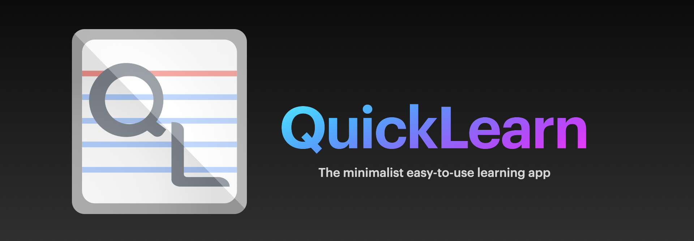

  

# QuickLearn

An easy way for students to learn and study.

## License

Distributed under the GPLv3 License. See `LICENSE` for more information.

## Libraries Used

These open source libraries were used to create this project.

* [AlertToast](https://github.com/elai950/AlertToast)
